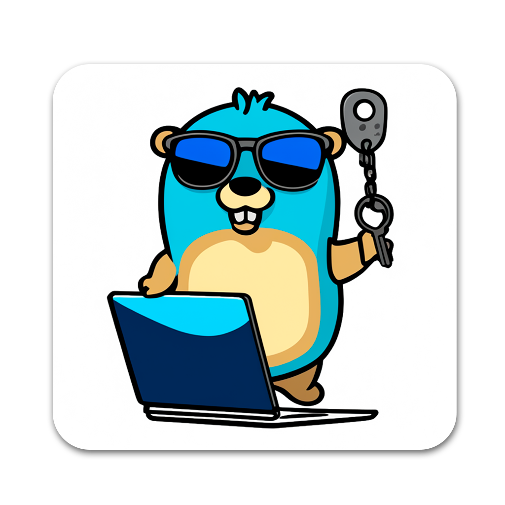
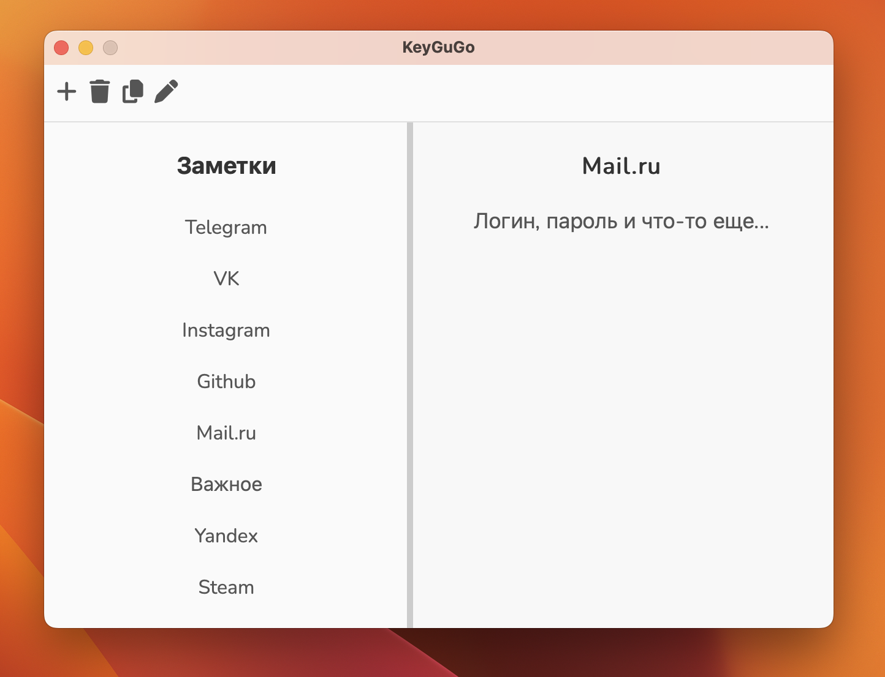

# KeyGuGo

Это приложение для хранения приватных данных. Здесь используется шифрование
AES-256-CBC с использованием локального хранилища. Ваши данные в полной сохранности.  

  

  

Функционал:
* Добавление заметок
* Удаление заметок
* Скопировать полностью содержимое заметки
* Редактировать заметку  

Приложение доступно на Windows x64, Linux x64, MacOS arm64.

## Dependencies
- Golang 1.22.4
- NodeJS 18.12.0

## Live Development

- `go get`
- `go install github.com/wailsapp/wails/v2/cmd/wails@latest`
- `cd frontend`
- `npm i`

go-sqlite3 is cgo package. If you want to build your app using go-sqlite3, you need gcc. However, after you have built and installed go-sqlite3 with go install github.com/mattn/go-sqlite3 (which requires gcc), you can build your app without relying on gcc in future.

Important: because this is a CGO enabled package, you are required to set the environment variable CGO_ENABLED=1 and have a **gcc compiler** present within your path.

1. set CGO_ENABLED=1
2. set CC=gcc

To run in live development mode, run `wails dev` in the project directory. This will run a Vite development
server that will provide very fast hot reload of your frontend changes. If you want to develop in a browser
and have access to your Go methods, there is also a dev server that runs on http://localhost:34115. Connect
to this in your browser, and you can call your Go code from devtools.

## Building

To build a redistributable, production mode package, use `wails build`.

## Fix problems

The wails command appears to be missing?
If your system is reporting that the wails command is missing or giving the error command 'wails' not found the it is probably due to go/bin directory is not added in the PATH variable

**if you don't get this error you can skip this section.**

to add that first you need to know in which directory the Go is installed in to find that you can run the following command in the terminal.

`go env GOPATH`

it will display the path where Go is installed in

let say the path in `home/[username]/go`

follow these steps to `home/[username]/go/bin/` in PATH environment

opened the terminal

open the `~/.bashrc` file
nano `~/.bashrc`

go to bottom of the file and add following line

export `PATH=$PATH:/home/[username]/go/bin/`

you should use the actual path of go/bin folder where the go is installed

don't forget to add / at the end

Press Ctrl + X to exit nano editor, and type "Y" to save changes.

Finally run the following command

`source ~/.bashrc`

PATH is successfully added

now you can check the installation using the command
wails version